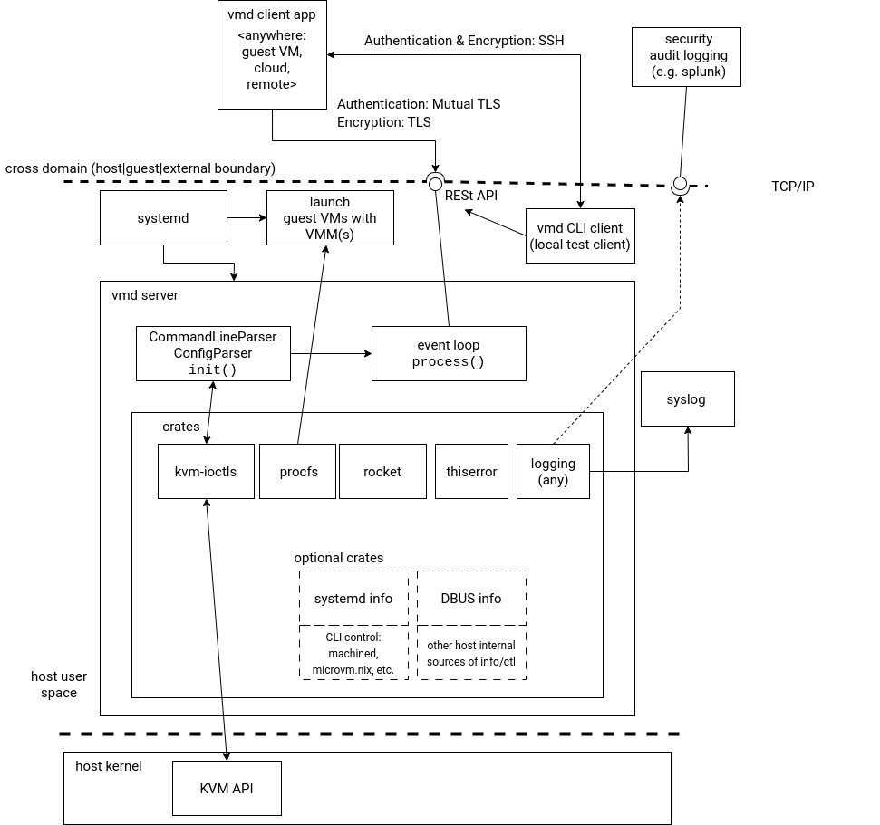

# `vmd` - Edge Virtualization Information and Control server - High-Level Design

## Status

Proposed

## Scope

`vmd` provides interface to virtualization information and control on Linux KVM-based host OS. The main scope of `vmd` is [Ghaf reference platform](https://github.com/tiiuae/ghaf) for edge virtualization. Scope of `vmd`-provided information is to enable system resource monitoring for both graphical and headless systems. In addition, highly privileged virtual machine controls will be supported.

## Overview

`vmd` context and proposed structure is presented in the following diagram:

## Requirements

### Functional requirements

* Provides information on virtual machines running on the host.
* Runs on host if the host supports the KVM user-space API and the underlying hardware has capabilities to support virtualization.
  * For compatibility with edge devices without virtualization support, `vmd` server may run to inform client about lack of capabilities.
* Per virtual machine information includes at least: memory and CPUs. Other resource information is optional - if in use.
* Controls for virtual machines: shutdown (if running from boot), start-up (if not running from boot) and resource reallocation (changes to CPU/memory and possible other resources - if in use).

### Non-functional requirements

* Server performance overhead should be optimized. Information is served upon request to avoid polling overhead.
* Implementation with secure systems programming: Rust for memory safety.
* Clients are authenticated (e.g. mutual TLS) to secure highly privileged information and operation on secure host.
* Communication between `vmd` and clients is encrypted (TLS).

## Design principle

### Loose coupling

`vmd` as a system component is weakly associated with both client applications and underlying interfaces. In practice, this could be achieved for example with REST API where get/set operations are atomic per operation. Other loosely coupled interfaces than RESt API can be considered as this design is at proposed state.

Other area of loose coupling is the system graphics architecture. `vmd` does not provide clients with information on the guest virtual machine graphics or GUI views. In practice, the host of `vmd` may or may not have Wayland compositor *but* the `vmd` does not provide its' clients any information on the Wayland or X clients. This decoupling is:
* practical - a ghaf system may be headless
* performance-driven - routing Wayland protocol through `vmd` is overhead. `vmd` server would not use client Wayland protocol on host for anything else but routing it to `vmd` client. This is because the Wayland compositor is not designed to be placed on host due to Ghaf platform GUI VM isolation. Decoupling this dependency provides better performance.
* security - `vmd` does not need to "see" what's in the guest virtual machines Wayland client views

If `vmd` clients need to provide views to either Wayland client views or the system view of Wayland compositor, the `vmd` clients are encouraged to obtain the information from those sources directly.

### Encapsulation

`vmd` encapsulates host internal sources of information and provides them to the clients over networked interface (TCP/IP). Encapsulation means that the host interfaces, such as KVM API or systemd APIs or rust-vmm crates, are not directly exposed to the `vmd` clients. This mechanism allows `vmd` server internal implementation to change without changes to external interface.

### Distributed

`vmd` backend supports distributed clients. Clients may run within the same system (inside the host or in guest virtual machines) or may access the `vmd` using secure connection over the internet. This supports graphical, command-line and web app clients - depending on the need and use case.

Distributed clients are served with asynchronous run-time (see overview diagram - rocket with tokio) grants the event loop with atomic operations.

To protect the `vmd` server and host from multiple clients trying change operations simultaneously, the asynchronous run-time can serve the requests in order and return e.g. `busy` for pending async VM change (e.g. VM restart that will take time). As this kind of scenario also concerns leak of information (operations of other clients) and denial-of-service (multiple VM changes), this is recommended to be accounted separately in `vmd` threat model. At high level, one option is to place a policy engine (e.g. zero trust architecture) to process the `vmd` backend requests.

## Considered alternatives

* Real-time streaming protocols (e.g. protobuf) as the main protocol of information exchange. Rationale: real-time will introduce both polling and sending, even if low frequency, that generate performance overhead even when the client is not using the data.
* `vmd` and clients communicating directly over inter virtual machine boundaries using D-BUS. Rationale: D-BUS may not be available nor feasible in headless systems as in inter-VM communication mechanism. Also, D-BUS is better suited for traditional single user space desktop operating system than for edge virtualization with or without desktop.

## Previous work
